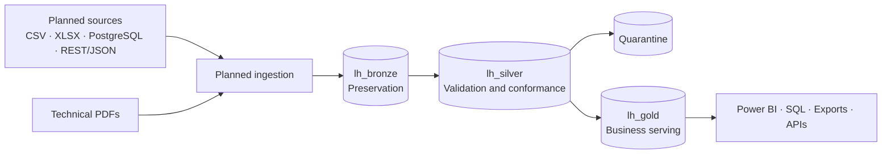

# Industrial Data Platform

Foundation for an end-to-end industrial data platform for the fictional organization
**Atlas Industrial Manufacturing**, built as a public portfolio project with Microsoft Fabric as
the primary platform.

This repository prioritizes correctness, security, traceability, and simplicity. All data and
examples are synthetic; no planned capability is presented as implemented.

[Leia em português](README.md)

## Project status

### Implemented — Phase 1

- Documented Medallion Architecture with separate `lh_bronze`, `lh_silver`, and `lh_gold`.
- Approved architectural decisions recorded as ADRs.
- Conceptual governance, RBAC, security, and observability models.
- Version-controlled conventions for Data Contracts and Data Quality rules.
- Quarantine strategy for critically invalid records.
- Tests for YAML standards and minimal CI for linting, formatting, and tests.

The `Industrial Data Platform - Lakehouse Analytics` workspace and the three Lakehouses already
exist and were created manually. Phase 1 does not implement ingestion or processing in them.

### Planned

- Synthetic operational data with controlled, documented anomalies.
- Incremental ingestion of CSV files from the MES simulator.
- Reading XLSX workbooks from the quality department.
- Local PostgreSQL-based AtlasERP.
- Fictional MaintControl REST/JSON API.
- Preservation of technical PDF documents in Bronze.
- Bronze → Silver transformation with validation and quarantine.
- Silver → Gold business rules and analytical modeling.
- Power BI semantic layer and reports.

### Stretch goals

- Controlled API serving.
- Optional analytical web application.
- Advanced deployment and infrastructure automation.
- Analytical processing of unstructured documents when supported by a concrete use case.

## Architecture



- **Bronze:** preserves source representation and ingestion metadata for traceability and
  reprocessing.
- **Silver:** applies types, normalization, deduplication, validation, integration, and conformance.
- **Gold:** provides business-oriented data to governed consumers without an exclusive dependency
  on Power BI.

PDFs also cross the conceptual ingestion boundary, preserving source metadata, batch tracking,
auditability, and reprocessing. They are initially stored as unstructured Bronze-only data and do
not participate in the tabular Silver → Gold flow.

Read the [complete architecture overview](docs/architecture/overview.md).

## Planned sources

| Fictional system | Technology | Domain |
|---|---|---|
| MES Simulator | Periodic CSV | Production events |
| Quality Department | XLSX | Quality inspections |
| AtlasERP | PostgreSQL | Machines, products, orders, and suppliers |
| MaintControl | REST / JSON | Maintenance and work orders |
| Technical Documents | PDF | Reports and technical documents |

## Documentation

- [Architecture and data flow](docs/architecture/overview.md)
- [Architecture Decision Records](docs/adr/README.md)
- [Governance, RBAC, and security](docs/governance/governance-and-security.md)
- [Data Quality and quarantine strategy](docs/data-quality/strategy.md)
- [Data Contract convention](docs/data-contracts/README.md)
- [Observability strategy](docs/observability/strategy.md)
- [Agent and contributor guide](AGENTS.md)

## Local development

Prerequisite: Python 3.13, aligned with Microsoft Fabric Runtime 2.0.

```powershell
python -m pip install --upgrade pip
python -m pip install --group dev
ruff check .
ruff format --check .
pytest
```

The project has development dependencies only in this phase. No Python package or industrial
processing logic is implemented.

## Security and data

- Never include real corporate data, PII, passwords, tokens, keys, or Fabric credentials.
- Copy `.env.example` to `.env` only when local configuration is required.
- Keep `.env` and other sensitive artifacts out of Git.
- Use only fictional examples suitable for public disclosure.

See the [governance and security policy](docs/governance/governance-and-security.md).

## License

Distributed under the [MIT License](LICENSE).
