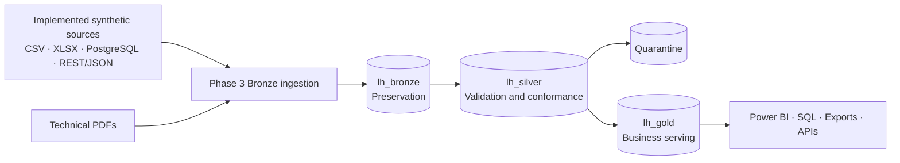

# Industrial Data Platform

Foundation for an end-to-end industrial data platform for the fictional organization
**Atlas Industrial Manufacturing**, built as a public portfolio project with Microsoft Fabric as
the primary platform.

This repository prioritizes correctness, security, traceability, and simplicity. All data and
examples are synthetic; no planned capability is presented as implemented.

[Leia em português](README.md)

## Project status

### Implemented — Phase 1

- Documented Medallion Architecture with separate `lh_bronze`, `lh_silver`, and `lh_gold`.
- Approved architectural decisions recorded as ADRs.
- Conceptual governance, RBAC, security, and observability models.
- Version-controlled conventions for Data Contracts and Data Quality rules.
- Quarantine strategy for critically invalid records.
- Tests for YAML standards and minimal CI for linting, formatting, and tests.

### Implemented — Phase 2

- Deterministic synthetic industrial source ecosystem for 2025.
- Local PostgreSQL AtlasERP through Docker Compose, monthly MES CSV, Quality XLSX, and read-only
  MaintControl REST/JSON API.
- Six deliberately simple technical PDFs for a future Bronze-only unstructured source.
- Controlled DQ anomalies with an external manifest, contracts, samples, and PostgreSQL integration
  tests in CI.
- Contracts for all ten outputs validate types, requiredness, uniqueness, enums, and DQ semantics
  in the clean baseline; syntactically valid unknown machine API filters return `200` with
  `data: []`.

The `Industrial Data Platform - Lakehouse Analytics` workspace and the three Lakehouses already
exist and were created manually.

### Implemented and accepted in Fabric — Phase 3 Bronze ingestion

- Accepted file-first, immutable Bronze paths and idempotency/replay rules.
- One batched preflight/finalize audit notebook; `ingestion_audit` is the only Phase 3 Delta table.
- Five source pipelines and the sequential orchestrator were validated in the tenant, with
  parent/child traceability in `ingestion_audit`.
- MES incremental ingestion, full AtlasERP/MaintControl snapshots, and binary XLSX/PDF preservation
  were demonstrated in Bronze.
- SharePoint Online File is preferred only after a tenant PoC; the OneLake demo staging fallback is
  always labeled honestly through `transport_source`.
- MaintControl was demonstrated through an ephemeral Cloudflare Quick Tunnel, with the API kept on
  loopback and its bearer token supplied only at runtime. This is demo-only and is not the
  production hosting recommendation.

Live tenant results are recorded independently in the
[Phase 3 execution evidence](docs/ingestion/execution-evidence.md); repository implementation is not
presented as proof that a Fabric run succeeded.

### Implemented in repository — Phase 4A/4B Silver MVP

- Audit-driven AtlasERP and MES Bronze → Silver transformation.
- Typed Delta tables for lines, machines, products, orders, and production events.
- Cataloged DQ rules, deterministic quarantine, and idempotent MERGE behavior.
- PySpark notebook and exact recipe for the independent `pl_transform_bronze_to_silver` pipeline.
- Tenant execution is not yet demonstrated; Quality, MaintControl, and Technical Documents remain
  outside this slice.

### Planned beyond the Silver MVP

- Silver extension for Quality, MaintControl, and Technical Document metadata.
- Silver → Gold business rules and analytical modeling.
- Power BI semantic layer and reports.

### Stretch goals

- Controlled API serving.
- Optional analytical web application.
- Advanced deployment and infrastructure automation.
- Analytical processing of unstructured documents when supported by a concrete use case.

## Architecture



- **Bronze:** preserves source representation and ingestion metadata for traceability and
  reprocessing.
- **Silver:** applies types, normalization, deduplication, validation, integration, and conformance.
- **Gold:** provides business-oriented data to governed consumers without an exclusive dependency
  on Power BI.

PDFs also cross the conceptual ingestion boundary, preserving source metadata, batch tracking,
auditability, and reprocessing. They are initially stored as unstructured Bronze-only data and do
not participate in the tabular Silver → Gold flow.

Read the [complete architecture overview](docs/architecture/overview.md).

## Implemented sources

| Fictional system | Technology | Domain |
|---|---|---|
| MES Simulator | Periodic CSV | Production events |
| Quality Department | XLSX | Quality inspections |
| AtlasERP | PostgreSQL | Lines, machines, products, and orders |
| MaintControl | REST / JSON | Maintenance and work orders |
| Technical Documents | PDF | Reports and technical documents |

## Documentation

- [Architecture and data flow](docs/architecture/overview.md)
- [Architecture Decision Records](docs/adr/README.md)
- [Governance, RBAC, and security](docs/governance/governance-and-security.md)
- [Data Quality and quarantine strategy](docs/data-quality/strategy.md)
- [Data Contract convention](docs/data-contracts/README.md)
- [Observability strategy](docs/observability/strategy.md)
- [Phase 2 source ecosystem](docs/sources/source-ecosystem.md)
- [Phase 3 Bronze runbook](docs/ingestion/phase3-runbook.md)
- [Phase 3 execution evidence](docs/ingestion/execution-evidence.md)
- [Phase 4A/4B production Silver slice](docs/silver/phase4-production-slice.md)
- [Agent and contributor guide](AGENTS.md)

## Local development

Prerequisite: Python 3.13, aligned with Microsoft Fabric Runtime 2.0.

```powershell
python -m pip install --upgrade pip
python -m pip install --group dev
ruff check .
ruff format --check .
pytest
```

Run `python -m pip install -e . --group dev`, `atlas-sim generate`, and read
[`docs/sources/source-ecosystem.md`](docs/sources/source-ecosystem.md) for local reproduction.

## Security and data

- Never include real corporate data, PII, passwords, tokens, keys, or Fabric credentials.
- Copy `.env.example` to `.env` only when local configuration is required.
- Keep `.env` and other sensitive artifacts out of Git.
- Use only fictional examples suitable for public disclosure.

See the [governance and security policy](docs/governance/governance-and-security.md).

## License

Distributed under the [MIT License](LICENSE).
