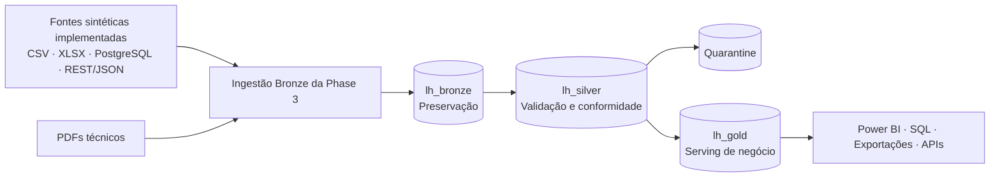

# Industrial Data Platform

Fundação de uma plataforma de dados industriais ponta a ponta para a organização fictícia
**Atlas Industrial Manufacturing**, construída como projeto público de portfólio com Microsoft
Fabric como plataforma principal.

Este repositório prioriza correção, segurança, rastreabilidade e simplicidade. Todos os dados e
exemplos são sintéticos; nenhuma capacidade planejada é apresentada como implementada.

[Read in English](README.en.md)

## Status do projeto

### Implementado — Phase 1

- Arquitetura Medallion documentada com `lh_bronze`, `lh_silver` e `lh_gold` separados.
- Decisões arquiteturais aprovadas registradas em ADRs.
- Modelo conceitual de governança, RBAC, segurança e observabilidade.
- Convenções versionadas para Data Contracts e regras de Data Quality.
- Estratégia de quarantine para registros criticamente inválidos.
- Testes dos padrões YAML e CI mínima para lint, formatação e testes.

### Implementado — Phase 2

- Ecossistema sintético determinístico de fontes industriais para 2025.
- AtlasERP em PostgreSQL local via Docker Compose, MES CSV mensal, Quality XLSX e API REST/JSON
  MaintControl somente leitura.
- Seis PDFs técnicos simples para demonstrar fonte não estruturada preservada futuramente no Bronze.
- Anomalias DQ controladas com manifesto externo, contratos, amostras e testes de integração
  PostgreSQL no CI.
- Contratos das dez saídas validam tipos, obrigatoriedade, unicidade, enums e semântica DQ na
  base limpa; filtros API de máquina sintaticamente válidos e desconhecidos retornam `200` com
  `data: []`.

O workspace `Industrial Data Platform - Lakehouse Analytics` e os três Lakehouses já existem e
foram criados manualmente.

### Implementado e aceito no Fabric — ingestão Bronze da Phase 3

- Caminhos Bronze file-first e imutáveis, com regras aceitas de idempotência e replay.
- Um notebook técnico em lotes para preflight/finalização; `ingestion_audit` é a única tabela Delta
  da Phase 3.
- Cinco pipelines de origem e o orquestrador sequencial foram validados no tenant, com
  rastreabilidade pai/filho em `ingestion_audit`.
- MES incremental, snapshots completos de AtlasERP/MaintControl e preservação binária de
  XLSX/PDF foram demonstrados em Bronze.
- SharePoint Online File é preferencial somente após PoC no tenant; o fallback OneLake demo staging
  é sempre identificado corretamente em `transport_source`.
- O MaintControl foi demonstrado por Cloudflare Quick Tunnel efêmero, sempre com API em loopback e
  bearer token fornecido apenas em runtime. O caminho é exclusivo de demo e não representa a
  recomendação de hospedagem para produção.

Resultados do tenant são registrados separadamente nas
[evidências de execução da Phase 3](docs/ingestion/execution-evidence.md); implementação no
repositório não é apresentada como prova de execução bem-sucedida no Fabric.

### Implementado e aceito no Fabric — Phase 4A/4B Silver MVP

- Transformação Bronze → Silver de AtlasERP e MES orientada por `ingestion_audit`.
- Tabelas Delta tipadas para linhas, máquinas, produtos, ordens e eventos de produção.
- Regras DQ catalogadas, quarantine determinística e MERGE idempotente.
- Notebook PySpark `nb_bronze_to_silver` validado por execuções repetidas no tenant.
- Pipeline independente `pl_transform_bronze_to_silver` criado, validado e executado com sucesso no Fabric.
- O `processing_run_id` é propagado dinamicamente a partir do Run ID do pipeline para rastreabilidade.
- A repetição da execução preservou as contagens Silver e manteve `quarantine_records` em 145 linhas,
  demonstrando idempotência para o recorte AtlasERP + MES.
- Quality, MaintControl e Technical Documents continuam intencionalmente fora deste MVP Silver.

### Implementado no repositório — Phase 5 Gold de produção

- Modelo estrela mínimo com dimensões de data, produto, máquina e linha de produção.
- Fato `fact_production_event` no grão explícito de um evento Silver aceito.
- Quantidades produzida, rejeitada e aceita fisicamente aditivas; taxas e médias permanecem
  medidas da camada semântica.
- Notebook PySpark com validação antes da publicação, diagnóstico não bloqueante de alinhamento de
  ordens e overwrite Delta determinístico.
- Especificação manual do pipeline independente `pl_transform_silver_to_gold`.
- O notebook e o pipeline Gold ainda não foram executados no tenant; não há evidência Fabric da
  Phase 5 neste momento.
- OEE, quantidade planejada e atingimento de produção permanecem explicitamente fora do MVP.

### Próximos incrementos

- Publicação e validação repetida do Gold no tenant Fabric.
- Camada semântica e dashboard de produção em Power BI.
- Extensão posterior da Silver para Quality, MaintControl e metadados de Technical Documents.

### Stretch goals

- Exposição controlada por APIs.
- Aplicação web analítica opcional.
- Automação avançada de implantação e infraestrutura.
- Processamento analítico de documentos não estruturados, condicionado a um caso de uso real.

## Arquitetura



- **Bronze:** preserva a representação da fonte e metadados de ingestão para rastreabilidade e
  reprocessamento.
- **Silver:** aplica tipos, normalização, deduplicação, validação, integração e conformidade.
- **Gold:** fornece dados orientados ao negócio para consumidores governados, sem dependência
  exclusiva de Power BI.

Os PDFs também atravessam o limite conceitual de ingestão, preservando metadados de origem, lote,
auditoria e reprocessamento. Eles são inicialmente armazenados como dados não estruturados apenas
no Bronze e não participam do fluxo tabular Silver → Gold.

Leia a [visão completa da arquitetura](docs/architecture/overview.md).

## Fontes implementadas

| Sistema fictício    | Tecnologia    | Domínio                             |
| ------------------- | ------------- | ----------------------------------- |
| MES Simulator       | CSV periódico | Eventos de produção                 |
| Quality Department  | XLSX          | Inspeções de qualidade              |
| AtlasERP            | PostgreSQL    | Linhas, máquinas, produtos e ordens |
| MaintControl        | REST / JSON   | Manutenção e ordens de serviço      |
| Technical Documents | PDF           | Relatórios e documentos técnicos    |

## Navegação

- [Arquitetura e fluxo de dados](docs/architecture/overview.md)
- [Architecture Decision Records](docs/adr/README.md)
- [Governança, RBAC e segurança](docs/governance/governance-and-security.md)
- [Estratégia de Data Quality e quarantine](docs/data-quality/strategy.md)
- [Convenção de Data Contracts](docs/data-contracts/README.md)
- [Estratégia de observabilidade](docs/observability/strategy.md)
- [Ecossistema de fontes da Phase 2](docs/sources/source-ecosystem.md)
- [Runbook Bronze da Phase 3](docs/ingestion/phase3-runbook.md)
- [Evidências de execução da Phase 3](docs/ingestion/execution-evidence.md)
- [Recorte Silver de produção da Phase 4A/4B](docs/silver/phase4-production-slice.md)
- [Handoff e evidências da Phase 4A/4B](docs/silver/phase4-handoff.md)
- [Modelo Gold de produção da Phase 5](docs/gold/phase5-production-mvp.md)
- [Handoff da Phase 5](docs/gold/phase5-handoff.md)
- [Guia para agentes e contribuidores](AGENTS.md)

## Desenvolvimento local

Pré-requisito: Python 3.13, alinhado ao Microsoft Fabric Runtime 2.0.

```powershell
python -m pip install --upgrade pip
python -m pip install --group dev
ruff check .
ruff format --check .
pytest
```

Execute `python -m pip install -e . --group dev`, `atlas-sim generate` e consulte
[`docs/sources/source-ecosystem.md`](docs/sources/source-ecosystem.md) para reprodução local.

## Segurança e dados

- Nunca inclua dados corporativos reais, PII, senhas, tokens, chaves ou credenciais Fabric.
- Copie `.env.example` para `.env` apenas quando configurações locais forem necessárias.
- Mantenha `.env` e outros artefatos sensíveis fora do Git.
- Use somente exemplos fictícios adequados para publicação.

Consulte a [política de governança e segurança](docs/governance/governance-and-security.md).

## Licença

Distribuído sob a [licença MIT](LICENSE).
