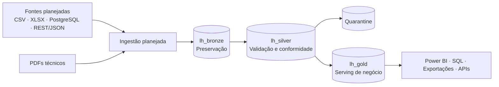

# Industrial Data Platform

Fundação de uma plataforma de dados industriais ponta a ponta para a organização fictícia
**Atlas Industrial Manufacturing**, construída como projeto público de portfólio com Microsoft
Fabric como plataforma principal.

Este repositório prioriza correção, segurança, rastreabilidade e simplicidade. Todos os dados e
exemplos são sintéticos; nenhuma capacidade planejada é apresentada como implementada.

[Read in English](README.en.md)

## Status do projeto

### Implementado — Phase 1

- Arquitetura Medallion documentada com `lh_bronze`, `lh_silver` e `lh_gold` separados.
- Decisões arquiteturais aprovadas registradas em ADRs.
- Modelo conceitual de governança, RBAC, segurança e observabilidade.
- Convenções versionadas para Data Contracts e regras de Data Quality.
- Estratégia de quarantine para registros criticamente inválidos.
- Testes dos padrões YAML e CI mínima para lint, formatação e testes.

O workspace `Industrial Data Platform - Lakehouse Analytics` e os três Lakehouses já existem e
foram criados manualmente. A Phase 1 não implementa ingestão ou processamento dentro deles.

### Planejado

- Dados sintéticos operacionais com anomalias controladas e documentadas.
- Ingestão incremental de arquivos CSV do simulador MES.
- Leitura de planilhas XLSX do departamento de qualidade.
- AtlasERP em PostgreSQL local.
- API REST/JSON fictícia MaintControl.
- Preservação de documentos técnicos PDF no Bronze.
- Transformações Bronze → Silver com validação e quarantine.
- Regras de negócio e modelagem analítica Silver → Gold.
- Camada semântica e relatórios Power BI.

### Stretch goals

- Exposição controlada por APIs.
- Aplicação web analítica opcional.
- Automação avançada de implantação e infraestrutura.
- Processamento analítico de documentos não estruturados, condicionado a um caso de uso real.

## Arquitetura



- **Bronze:** preserva a representação da fonte e metadados de ingestão para rastreabilidade e
  reprocessamento.
- **Silver:** aplica tipos, normalização, deduplicação, validação, integração e conformidade.
- **Gold:** fornece dados orientados ao negócio para consumidores governados, sem dependência
  exclusiva de Power BI.

Os PDFs também atravessam o limite conceitual de ingestão, preservando metadados de origem, lote,
auditoria e reprocessamento. Eles são inicialmente armazenados como dados não estruturados apenas
no Bronze e não participam do fluxo tabular Silver → Gold.

Leia a [visão completa da arquitetura](docs/architecture/overview.md).

## Fontes planejadas

| Sistema fictício | Tecnologia | Domínio |
|---|---|---|
| MES Simulator | CSV periódico | Eventos de produção |
| Quality Department | XLSX | Inspeções de qualidade |
| AtlasERP | PostgreSQL | Máquinas, produtos, ordens e fornecedores |
| MaintControl | REST / JSON | Manutenção e ordens de serviço |
| Technical Documents | PDF | Relatórios e documentos técnicos |

## Navegação

- [Arquitetura e fluxo de dados](docs/architecture/overview.md)
- [Architecture Decision Records](docs/adr/README.md)
- [Governança, RBAC e segurança](docs/governance/governance-and-security.md)
- [Estratégia de Data Quality e quarantine](docs/data-quality/strategy.md)
- [Convenção de Data Contracts](docs/data-contracts/README.md)
- [Estratégia de observabilidade](docs/observability/strategy.md)
- [Guia para agentes e contribuidores](AGENTS.md)

## Desenvolvimento local

Pré-requisito: Python 3.13, alinhado ao Microsoft Fabric Runtime 2.0.

```powershell
python -m pip install --upgrade pip
python -m pip install --group dev
ruff check .
ruff format --check .
pytest
```

O projeto usa apenas dependências de desenvolvimento nesta fase. Não existe pacote Python ou lógica
de processamento industrial implementada.

## Segurança e dados

- Nunca inclua dados corporativos reais, PII, senhas, tokens, chaves ou credenciais Fabric.
- Copie `.env.example` para `.env` apenas quando configurações locais forem necessárias.
- Mantenha `.env` e outros artefatos sensíveis fora do Git.
- Use somente exemplos fictícios adequados para publicação.

Consulte a [política de governança e segurança](docs/governance/governance-and-security.md).

## Licença

Distribuído sob a [licença MIT](LICENSE).
