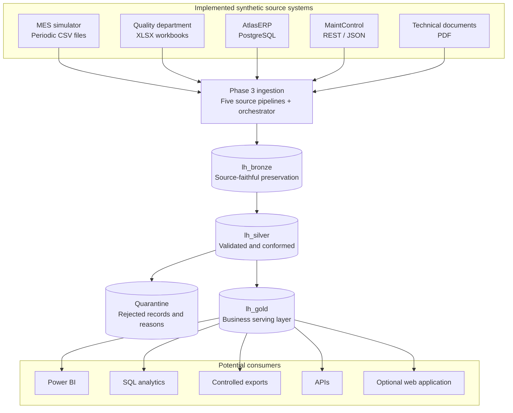

# Platform architecture

## Purpose and current state

Atlas Industrial Manufacturing is a fictional organization used to demonstrate an end-to-end
industrial data platform without real company data. The target platform is Microsoft Fabric.

The Fabric workspace `Industrial Data Platform - Lakehouse Analytics` and the Lakehouses
`lh_bronze`, `lh_silver`, and `lh_gold` already exist and were created manually.

Phase 1 added the repository and architectural foundation.

Phase 2 implements the synthetic source ecosystem locally.

Phase 3 implements and demonstrates the file-first Bronze ingestion layer and its audit control
plane in Microsoft Fabric.

Phase 4A/4B implements the source-controlled AtlasERP and MES Bronze-to-Silver production slice.
The Silver notebook and the independent `pl_transform_bronze_to_silver` pipeline have both been
successfully executed in the Fabric tenant. Repeated execution preserved the Silver business row
counts and deterministic quarantine state, providing tenant-side evidence of idempotent behavior
for the current production slice.

Quality, MaintControl, Technical Documents, Gold, Power BI, and other serving models remain outside
this implemented Silver slice.

## Logical data flow

Technical PDFs pass through the same ingestion boundary as the other sources so they retain source
metadata, batch tracking, auditability, ingestion controls, and replay context.

They are preserved as unstructured Bronze assets and do not initially participate in the tabular
Silver-to-Gold flow.

Phase 3 uses binary Copy with source/destination verification and no OCR or extraction. This
boundary is intentional and may be revisited only through a future architectural decision.

## Layer responsibilities

### Bronze

Bronze preserves source data as faithfully as practical and supports traceability and reprocessing.

Business-invalid values are not silently corrected. Records or files carry technical metadata such
as:

- `source_system`
- `source_object`
- `source_file`, where applicable
- `ingestion_timestamp`
- `batch_id`

Phase 3 lands source-faithful files beneath `Files/raw/<source>/<object>/`, partitions time-bearing
sources by source period or snapshot/extraction date, and always creates an immutable `batch_id`
directory.

`ingestion_audit` is the only Phase 3 Delta table and acts as the Bronze ingestion control plane.

See the [Phase 3 runbook](../ingestion/phase3-runbook.md) for exact paths, audit behavior, and replay
rules.

### Silver

Silver is responsible for type enforcement, normalization, standardization, deduplication,
reference validation, conformity, integration, and data quality.

Critical invalid records are sent to quarantine with their source and validation context instead of
disappearing from the processing history.

The currently implemented Phase 4A/4B production slice consumes accepted Bronze batches through
`lh_bronze.dbo.ingestion_audit` and materializes the following Delta tables in `lh_silver.dbo`:

- `production_lines`
- `machines`
- `products`
- `production_orders`
- `production_events`
- `quarantine_records`

The current implementation uses deterministic record hashes, deterministic quarantine identities,
and Delta MERGE behavior to support safe repeated execution.

The Silver production slice is executed through the source-controlled notebook
`nb_bronze_to_silver` and the independent Fabric pipeline `pl_transform_bronze_to_silver`.

Quality, MaintControl, and Technical Documents remain outside the current Silver MVP.

### Gold

Gold exposes governed, business-oriented data and is not coupled exclusively to Power BI.

The Gold dimensional model has not yet been implemented. Every future fact table must document its
grain before implementation.

The next planned portfolio increment is a minimal production-oriented Gold model sufficient to
support the first Power BI production dashboard.

## Workspace boundary

The three Lakehouses remain in one Fabric workspace for the portfolio environment.

This keeps the raw, validated, and serving boundaries explicit without introducing multi-workspace
operational complexity.

A larger deployment may separate workspaces by environment, domain, team, ownership, or security
requirements.

## Planned industrial context

- Three production lines: `LINE-01`, `LINE-02`, and `LINE-03`.
- Approximately 12 machines and eight fictional products.
- `SHIFT-A` from 06:00 to 14:00.
- `SHIFT-B` from 14:00 to 22:00.
- `SHIFT-C` from 22:00 to 06:00.
- Approximately 12 months of synthetic operational history.

These are implemented simulator defaults; topology and scale remain configuration values rather than
claims about a real facility.

## Implemented execution path

The currently demonstrated production path is:

`AtlasERP / MES → Phase 3 Bronze ingestion → lh_bronze → Phase 4 Silver transformation → lh_silver`

Phase 3 provides source ingestion, immutable Bronze storage, ingestion audit, idempotency, replay,
and source-level traceability.

Phase 4A/4B consumes accepted Bronze data and provides typed, validated, conformed, and
quarantine-aware production data.

The Silver transformation can be executed independently through:

`pl_transform_bronze_to_silver`

with the notebook parameter:

`domain = all`

and:

`processing_run_id = @pipeline().RunId`

This preserves execution-level traceability between the Fabric pipeline and the Silver processing
run.

## Explicitly deferred decisions

The following decisions remain intentionally deferred until a concrete later phase requires them:

- Gold dimensional modeling beyond the first minimal production model;
- Power BI semantic model design and report structure;
- Silver implementation for Quality;
- Silver implementation for MaintControl;
- Silver handling of Technical Document metadata;
- production snapshot consistency strategy;
- retention policies and operational SLOs;
- production-grade MaintControl hosting/connectivity;
- Fabric Git Integration;
- environment/workspace separation;
- controlled API serving;
- optional web application architecture;
- analytical processing of unstructured documents.

Bronze-to-Silver implementation technology is no longer deferred: the current production MVP uses
a source-controlled PySpark notebook executed through an independent Microsoft Fabric pipeline.
