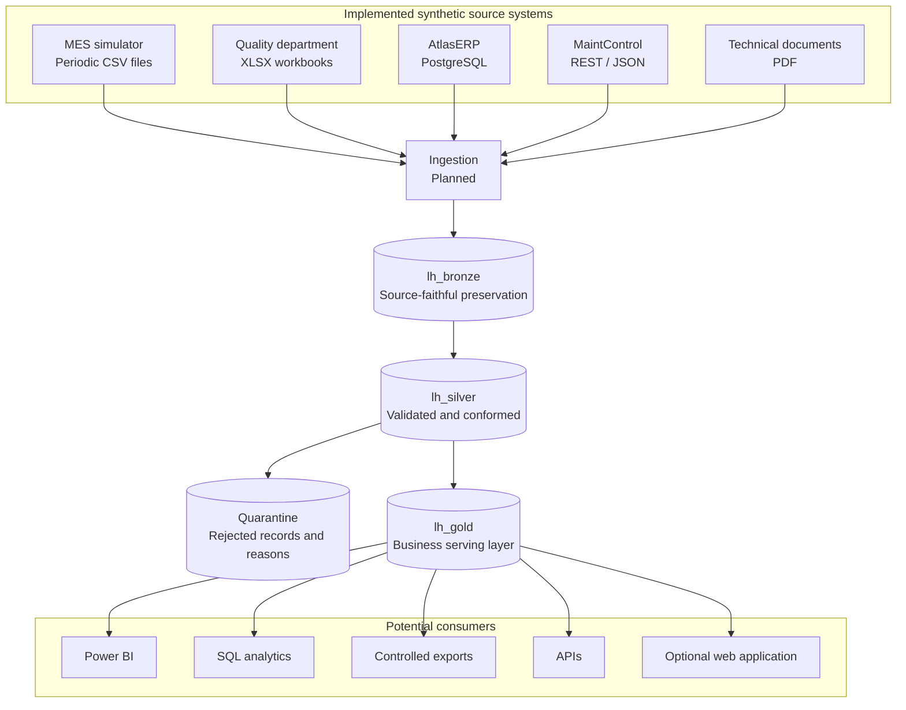

# Platform architecture

## Purpose and current state

Atlas Industrial Manufacturing is a fictional organization used to demonstrate an end-to-end
industrial data platform without real company data. The target platform is Microsoft Fabric.

The Fabric workspace `Industrial Data Platform - Lakehouse Analytics` and the Lakehouses
`lh_bronze`, `lh_silver`, and `lh_gold` already exist and were created manually. Phase 1 added the
repository and architectural foundation. Phase 2 implements the synthetic source ecosystem locally.
Fabric ingestion, transformation, and serving models remain planned.

## Logical data flow

Technical PDFs pass through the same conceptual ingestion boundary as the other sources so they
retain source metadata, batch tracking, auditability, ingestion controls, and replay context. They
are preserved as unstructured Bronze assets and do not initially participate in the tabular
Silver-to-Gold flow. No specific PDF ingestion technology has been selected. This boundary is
intentional and may be revisited only through a future architectural decision.

## Layer responsibilities

### Bronze

Bronze preserves source data as faithfully as practical and supports traceability and reprocessing.
Business-invalid values are not silently corrected. Records or files will carry technical metadata
such as:

- `source_system`
- `source_object`
- `source_file`, where applicable
- `ingestion_timestamp`
- `batch_id`

Physical storage layout, partitioning, and file formats will be decided with the first ingestion
implementation.

### Silver

Silver is responsible for type enforcement, normalization, standardization, deduplication,
reference validation, conformity, integration, and data quality. Critical invalid records are sent
to quarantine with their source and validation context instead of disappearing from the processing
history.

### Gold

Gold exposes governed, business-oriented data and is not coupled to Power BI. Its dimensional model
is intentionally undecided. Every future fact table must document its grain before implementation.

## Workspace boundary

The three Lakehouses remain in one Fabric workspace for the portfolio environment. This keeps the
raw, validated, and serving boundaries explicit without introducing multi-workspace operational
complexity. A larger deployment may separate workspaces by environment, domain, team, ownership,
or security requirements.

## Planned industrial context

- Three production lines: `LINE-01`, `LINE-02`, and `LINE-03`.
- Approximately 12 machines and eight fictional products.
- `SHIFT-A` from 06:00 to 14:00, `SHIFT-B` from 14:00 to 22:00, and `SHIFT-C` from
  22:00 to 06:00.
- Approximately 12 months of synthetic operational history.

These are implemented simulator defaults; topology and scale remain configuration values rather than
claims about a real facility.

## Explicitly deferred decisions

Pandas versus Polars, API framework, Docker topology, physical partitioning, Gold dimensional
modeling, and web application architecture remain undecided. They will be evaluated when a concrete
phase requires them.
